# Data Pipeline Project Plan

A Docker Compose-based data pipeline that generates fake weather data, sends it through a logging server to Kafka, writes to Iceberg tables on MinIO via Kafka Connect, performs real-time aggregation with Flink, and enables querying via Trino.

## Architecture Diagram

```mermaid
flowchart TB
    %% Styling Definitions - Lucid Charts inspired color palette
    classDef dataGen fill:#4A90E2,stroke:#2E5C8A,stroke-width:3px,color:#fff,font-weight:bold
    classDef messaging fill:#50C878,stroke:#2D8659,stroke-width:3px,color:#fff,font-weight:bold
    classDef processing fill:#FF6B6B,stroke:#CC5555,stroke-width:3px,color:#fff,font-weight:bold
    classDef storage fill:#9B59B6,stroke:#7D3C98,stroke-width:3px,color:#fff,font-weight:bold
    classDef query fill:#F39C12,stroke:#C87F0A,stroke-width:3px,color:#fff,font-weight:bold
    classDef viz fill:#E74C3C,stroke:#B03A2E,stroke-width:3px,color:#fff,font-weight:bold
    classDef metadata fill:#34495E,stroke:#2C3E50,stroke-width:3px,color:#fff,font-weight:bold
    
    %% Data Generation Layer
    subgraph GEN["📊 DATA GENERATION LAYER"]
        direction TB
        Client["Client<br/>━━━━━━━━━━━━━━<br/>Python HTTP Client<br/>Generates 10 records<br/>every 5 seconds"]
        LoggingServer["Logging Server<br/>━━━━━━━━━━━━━━<br/>Flask API :9998<br/>Receives & forwards<br/>to Kafka"]
    end
    
    %% Message Broker Layer
    subgraph MSG["📨 MESSAGE BROKER LAYER"]
        direction TB
        Zookeeper["Zookeeper<br/>━━━━━━━━━━━━━━<br/>:2181<br/>Cluster Coordination"]
        Kafka["Kafka<br/>━━━━━━━━━━━━━━<br/>:9092<br/>Message Broker<br/>Topic: weather"]
        KafkaConnect["Kafka Connect<br/>━━━━━━━━━━━━━━<br/>:8083<br/>Iceberg Sink Connector"]
    end
    
    %% Real-time Processing Layer
    subgraph RT["⚡ REAL-TIME PROCESSING LAYER"]
        direction TB
        FlinkJM["Flink JobManager<br/>━━━━━━━━━━━━━━<br/>:8081<br/>Cluster Manager"]
        FlinkTM["Flink TaskManager<br/>━━━━━━━━━━━━━━<br/>Task Executor<br/>5s Tumbling Windows"]
        FlinkSQL["Flink SQL Client<br/>━━━━━━━━━━━━━━<br/>Job Submitter"]
    end
    
    %% Storage Layer
    subgraph STOR["💾 STORAGE LAYER"]
        direction TB
        MinIO["MinIO<br/>━━━━━━━━━━━━━━<br/>S3 Storage :9000<br/>s3a://warehouse/"]
        PostgresAnalytics["PostgreSQL Analytics<br/>━━━━━━━━━━━━━━<br/>:7777<br/>Real-time Aggregations"]
    end
    
    %% Metadata Storage
    subgraph META["📋 METADATA LAYER"]
        direction TB
        PostgreSQL["PostgreSQL Metastore<br/>━━━━━━━━━━━━━━<br/>:5432<br/>Catalog Backend"]
        HiveMetastore["Hive Metastore<br/>━━━━━━━━━━━━━━<br/>:9083<br/>Iceberg Catalog"]
    end
    
    %% Query Layer
    subgraph QUERY["🔍 QUERY LAYER"]
        direction TB
        Trino["Trino<br/>━━━━━━━━━━━━━━<br/>SQL Engine :8080<br/>Query Iceberg Tables"]
    end
    
    %% Visualization Layer
    subgraph VIZ["📈 VISUALIZATION LAYER"]
        direction TB
        VizServer["Visualization Server<br/>━━━━━━━━━━━━━━<br/>Node.js :3000<br/>Real-time Dashboard"]
    end
    
    %% Data Flow - Generation
    Client -->|HTTP GET<br/>/log?city=X&temp=Y| LoggingServer
    LoggingServer -->|Produce JSON<br/>to weather topic| Kafka
    
    %% Message Broker Coordination
    Zookeeper -.->|Coordinates<br/>Cluster State| Kafka
    
    %% Data Flow - Batch Processing
    Kafka -->|Consume<br/>weather topic| KafkaConnect
    KafkaConnect -->|Write Parquet<br/>Files| MinIO
    KafkaConnect -->|Register<br/>Table Metadata| HiveMetastore
    
    %% Data Flow - Real-time Processing
    Kafka -->|Consume<br/>weather topic| FlinkTM
    FlinkJM -.->|Manages<br/>Job Execution| FlinkTM
    FlinkSQL -.->|Submits<br/>SQL Jobs| FlinkJM
    FlinkTM -->|Write Avg Temp<br/>every 5 seconds| PostgresAnalytics
    
    %% Metadata Flow
    PostgreSQL -.->|Stores<br/>Catalog Metadata| HiveMetastore
    
    %% Query Flow
    Trino -->|Query<br/>Table Schema| HiveMetastore
    Trino -->|Read<br/>Parquet Files| MinIO
    
    %% Visualization Flow
    VizServer -->|Query<br/>Aggregated Data| PostgresAnalytics
    
    %% Apply Styles
    class Client,LoggingServer dataGen
    class Zookeeper,Kafka,KafkaConnect messaging
    class FlinkJM,FlinkTM,FlinkSQL processing
    class MinIO,PostgresAnalytics storage
    class PostgreSQL,HiveMetastore metadata
    class Trino query
    class VizServer viz
```



> **💡 View the Diagram in Your Browser:** Open `architecture-diagram.html` in any web browser for an interactive, full-screen view of the architecture diagram.

## Data Flow


## Container Details

| Container | Image | Port | Purpose |
|-----------|-------|------|---------|
| minio | minio/minio | 9000, 9001 | S3-compatible object storage for Iceberg data files |
| minio-init | minio/mc | - | Initializes the 'warehouse' bucket |
| postgres | postgres:15 | 5432 | Backend database for Hive Metastore |
| postgres-analytics | postgres:15 | 7777 | Stores real-time aggregated weather data from Flink |
| hive-metastore | Custom | 9083 | Iceberg table catalog (Thrift service) |
| zookeeper | confluentinc/cp-zookeeper:7.5.0 | 2181 | Kafka cluster coordination |
| kafka | confluentinc/cp-kafka:7.5.0 | 9092 | Message broker |
| kafka-connect | Custom | 8083 | Runs Iceberg sink connector |
| flink-jobmanager | Custom (Flink 1.18) | 8081 | Flink cluster manager |
| flink-taskmanager | Custom (Flink 1.18) | - | Flink task executor |
| flink-sql-client | Custom (Flink 1.18) | - | Submits Flink SQL jobs |
| logging-server | Custom | 9998 | Flask web server that receives weather data and sends to Kafka |
| client | Custom | - | Python HTTP client generating weather data |
| visualization-server | Custom (Node.js) | 3000 | Real-time dashboard with Google Charts |
| trino | Custom (trinodb/trino base) | 8080 | SQL query engine for Iceberg tables with automatic table initialization |

## Directory Structure

```
├── compose.yaml                 # Docker Compose configuration
├── run.sh                       # Build and startup script
├── PLAN.md                      # This file
├── client/
│   ├── Dockerfile               # Python 3.11 slim image
│   ├── producer.py              # HTTP client sending to logging server
│   └── requirements.txt         # requests, faker
├── logging-server/
│   ├── Dockerfile               # Python 3.11 slim + Flask
│   ├── server.py                # Flask server with /log endpoint
│   └── requirements.txt         # flask, confluent-kafka
├── visualization-server/
│   ├── Dockerfile               # Node.js 20 slim
│   ├── package.json             # express, pg dependencies
│   ├── server.js                # Express server with PostgreSQL connection
│   └── public/
│       └── index.html           # Dashboard with Google Charts
├── flink/
│   ├── Dockerfile               # Flink 1.18 with Kafka/JDBC connectors
│   ├── docker-entrypoint.sh     # Custom entrypoint script
│   ├── submit-job.sh            # Job submission script
│   ├── init-analytics-db.sql    # PostgreSQL analytics table schema
│   └── sql/
│       └── weather-aggregation.sql  # Flink SQL job definition
├── hive-metastore/
│   ├── Dockerfile               # Eclipse Temurin JRE 11 + Hive 3.1.3
│   └── metastore-site.xml       # Metastore configuration
├── kafka-connect/
│   ├── Dockerfile               # Confluent Kafka Connect + Iceberg connector
│   └── register-connector.sh    # Connector registration script
└── trino/
    ├── Dockerfile               # Custom Trino image with CLI and initialization
    ├── docker-entrypoint.sh     # Entrypoint script that runs SQL after startup
    ├── sql/
    │   └── init-tables.sql      # SQL script to create Iceberg tables on startup
    └── etc/
        ├── config.properties    # Trino server config
        ├── node.properties      # Trino node config
        ├── jvm.config           # JVM settings
        └── catalog/
            └── iceberg.properties  # Iceberg catalog config
```

## Flink Real-time Processing

### Flink SQL Job

The Flink job performs the following:
1. Consumes JSON messages from Kafka `weather` topic
2. Parses the weather data (city, temperature, ts)
3. Aggregates average temperature per city every 5 seconds using tumbling windows
4. Writes results to PostgreSQL `analytics.weather` table

### PostgreSQL Analytics Schema

```sql
CREATE TABLE weather (
    city VARCHAR(255) NOT NULL,
    avg_temperature DOUBLE PRECISION,
    window_start TIMESTAMP,
    window_end TIMESTAMP,
    record_count BIGINT,
    last_updated TIMESTAMP DEFAULT CURRENT_TIMESTAMP,
    PRIMARY KEY (city, window_start)
);
```

### Query Analytics Data

```bash
# Connect to analytics PostgreSQL
docker exec -it postgres-analytics psql -U analytics -d analytics

# Query aggregated data
SELECT * FROM weather ORDER BY window_start DESC LIMIT 10;

# Average temperature by city
SELECT city, AVG(avg_temperature) as overall_avg 
FROM weather 
GROUP BY city 
ORDER BY overall_avg DESC;
```

## Logging Server API

### GET /log

Accepts weather data and sends it to Kafka.

**Query Parameters:**
| Parameter | Type | Required | Description |
|-----------|------|----------|-------------|
| city | string | Yes | City name |
| temperature | string | Yes | Temperature value |

**Response:**
```json
{
  "status": "success",
  "message": "Weather data logged",
  "data": {
    "city": "New York",
    "temperature": "72.5",
    "ts": "2026-01-08-14"
  }
}
```

### GET /health

Health check endpoint.

**Response:**
```json
{
  "status": "healthy"
}
```

## Visualization Server

The visualization server provides a real-time dashboard for monitoring weather data aggregations.

### Features

- **Real-time updates**: Polls PostgreSQL every 2 seconds for new data
- **10 line charts**: One chart per city tracking temperature over time
- **Stats bar**: Shows total cities, data points, average temperature, and last update time
- **Modern dark theme**: Gradient backgrounds, animations, and responsive design

### Cities Tracked

The dashboard displays data for the following 10 cities (matching the client):
- San Francisco, New York, Los Angeles, Chicago, Houston
- Phoenix, Seattle, Denver, Miami, Boston

### API Endpoints

#### GET /api/weather
Returns all historical weather data grouped by city.

**Response:**
```json
{
  "cities": ["San Francisco", "New York", ...],
  "data": {
    "San Francisco": [
      {"time": "2026-01-08T14:30:00.000Z", "temperature": 72.5},
      ...
    ],
    ...
  }
}
```

#### GET /api/weather/latest?since=<timestamp>
Returns weather data since the specified timestamp (for incremental updates).

#### GET /health
Health check endpoint.

### Access the Dashboard

Open http://localhost:3000 in your browser to view the real-time weather analytics dashboard.

## Data Schema

The weather data has the following JSON structure:

```json
{
  "city": "North Sharonstad",
  "temperature": "80.59",
  "ts": "2026-01-08-14"
}
```

| Field | Type | Description |
|-------|------|-------------|
| city | string | Randomly generated fake city name |
| temperature | string | Random temperature (0-120°F) |
| ts | string | Timestamp in YYYY-MM-DD-HH format, used for partitioning |

## Iceberg Table

The Iceberg table is automatically created when Trino starts via the initialization script.

### Table Structure

- **Catalog**: iceberg
- **Database**: default
- **Table**: weather
- **Location**: s3a://warehouse/weather

### Schema

```sql
CREATE TABLE iceberg.default.weather (
    city VARCHAR,
    temperature VARCHAR,
    ts TIMESTAMP WITH TIME ZONE
) WITH (
    compression_codec = 'ZSTD',
    format = 'PARQUET',
    format_version = 2,
    location = 's3a://warehouse/weather',
    partitioning = ARRAY['hour(ts)']
);
```

### Table Properties

| Property | Value | Description |
|----------|-------|-------------|
| Format | PARQUET | File format for data storage |
| Format Version | 2 | Iceberg format version |
| Compression | ZSTD | Compression codec for Parquet files |
| Partitioning | hour(ts) | Partitioned by hour of timestamp |
| Location | s3a://warehouse/weather | Storage location in MinIO |

### Initialization

The table is created automatically when the Trino container starts by executing `/opt/trino/sql/init-tables.sql` via the custom entrypoint script. This ensures the table exists before Kafka Connect starts writing data.

## Configuration

### Credentials

| Service | Username | Password | Port |
|---------|----------|----------|------|
| MinIO | admin | password | 9000/9001 |
| PostgreSQL (Metastore) | hive | hive | 5432 |
| PostgreSQL (Analytics) | analytics | analytics | 7777 |

### Network

All containers are connected via the `datapipeline` bridge network.

## Usage

### Start the Pipeline

```bash
./run.sh
```

This will:
1. Build custom Docker images
2. Start all services
3. Wait for Trino to be ready and create Iceberg tables
4. Wait for Kafka Connect to be ready
5. Register the Iceberg sink connector

### Test the Logging Server

```bash
# Send a test weather record
curl "http://localhost:9998/log?city=TestCity&temperature=75.5"

# Check health
curl http://localhost:9998/health
```

### Trino Table Initialization

Trino automatically creates the Iceberg table on startup by executing the SQL script at `/opt/trino/sql/init-tables.sql`. The custom entrypoint script:

1. Starts the Trino server
2. Waits for Trino to be healthy (checks `/v1/info` endpoint)
3. Executes the SQL initialization script using the Trino CLI
4. Keeps the container running

This ensures the table exists before Kafka Connect starts writing data. The table creation SQL can be modified in `trino/sql/init-tables.sql`.

### Dependencies

- **kafka-connect** depends on **trino** being healthy before starting
- This ensures the Iceberg table exists before the connector attempts to write data

## Query Batch Data with Trino

```bash
docker exec -it trino trino
```

```sql
-- Show catalogs
SHOW CATALOGS;

-- Show tables
SHOW TABLES FROM iceberg.default;

-- Query weather data
SELECT * FROM iceberg.default.weather;

-- Query by partition (hour-based partitioning)
SELECT * FROM iceberg.default.weather WHERE hour(ts) = 14;

-- Aggregate queries
SELECT city, AVG(CAST(temperature AS DOUBLE)) as avg_temp 
FROM iceberg.default.weather 
GROUP BY city;

-- Query with time range
SELECT * FROM iceberg.default.weather 
WHERE ts >= TIMESTAMP '2026-01-08 14:00:00' 
  AND ts < TIMESTAMP '2026-01-08 15:00:00';
```

### Query Real-time Aggregated Data

```bash
# Connect to PostgreSQL analytics
docker exec -it postgres-analytics psql -U analytics -d analytics

# View latest aggregations
SELECT * FROM weather ORDER BY window_start DESC LIMIT 10;

# View average temperature by city
SELECT city, AVG(avg_temperature) as overall_avg, SUM(record_count) as total_records
FROM weather 
GROUP BY city 
ORDER BY overall_avg DESC;
```

### View Flink Dashboard

Open http://localhost:8081 to view the Flink web UI and monitor running jobs.

### View Logs

```bash
# Client logs
docker compose logs -f client

# Logging server logs
docker compose logs -f logging-server

# Visualization server logs
docker compose logs -f visualization-server

# Kafka Connect logs
docker compose logs -f kafka-connect

# Flink logs
docker compose logs -f flink-jobmanager
docker compose logs -f flink-taskmanager
docker compose logs -f flink-sql-client

# All logs
docker compose logs -f
```

### Access Services

- **Weather Dashboard**: http://localhost:3000 (real-time visualization)
- **Logging Server**: http://localhost:9998
- **MinIO Console**: http://localhost:9001 (admin/password)
- **Kafka Connect REST API**: http://localhost:8083
- **Flink Dashboard**: http://localhost:8081
- **Trino Web UI**: http://localhost:8080
- **PostgreSQL Analytics**: localhost:7777 (analytics/analytics)

### Stop the Pipeline

```bash
docker compose down
```

### Clean Up Everything

```bash
docker compose down -v  # Removes volumes too
```

## Troubleshooting

### Check Connector Status

```bash
curl http://localhost:8083/connectors/iceberg-sink/status | jq
```

### Restart a Failed Connector Task

```bash
curl -X POST http://localhost:8083/connectors/iceberg-sink/tasks/0/restart
```

### Check Flink Jobs

```bash
curl http://localhost:8081/jobs/overview | jq
```

### Check Kafka Topics

```bash
docker exec -it kafka kafka-topics --bootstrap-server localhost:9092 --list
```

### Check MinIO Bucket Contents

```bash
docker exec -it minio mc ls myminio/warehouse --recursive
```

### Restart Flink SQL Job

```bash
docker compose restart flink-sql-client
```
